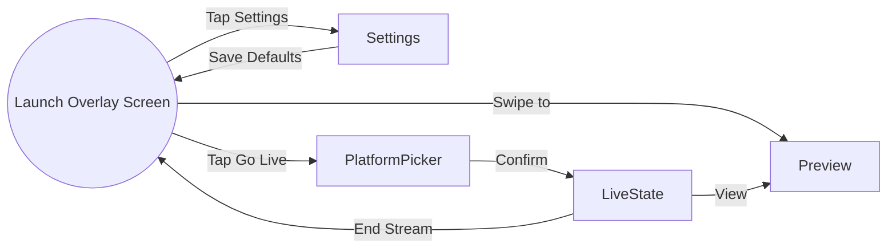
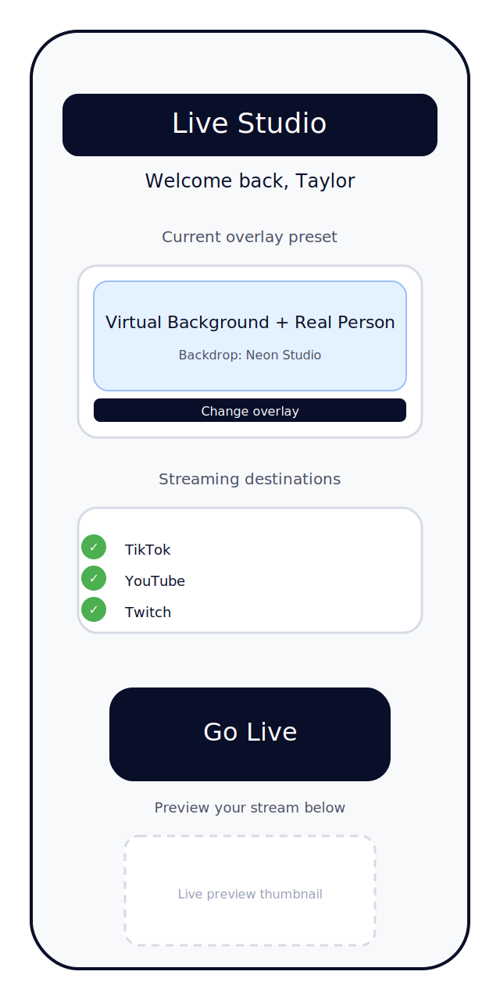
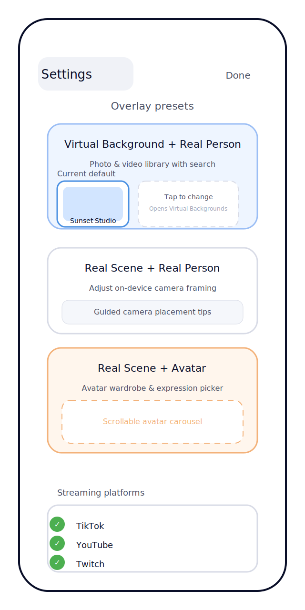
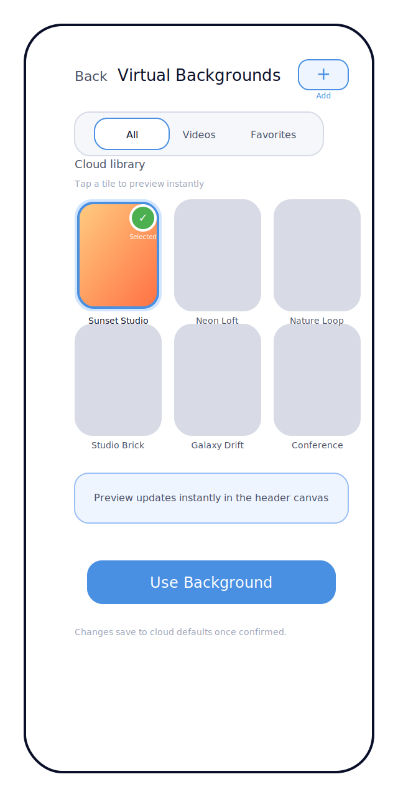
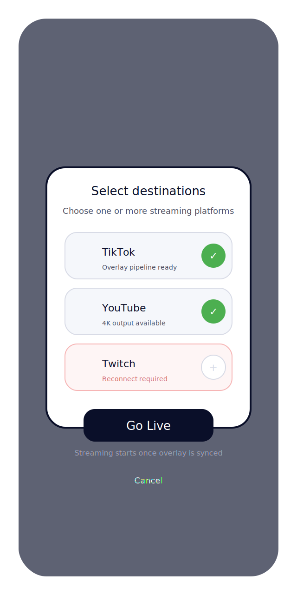
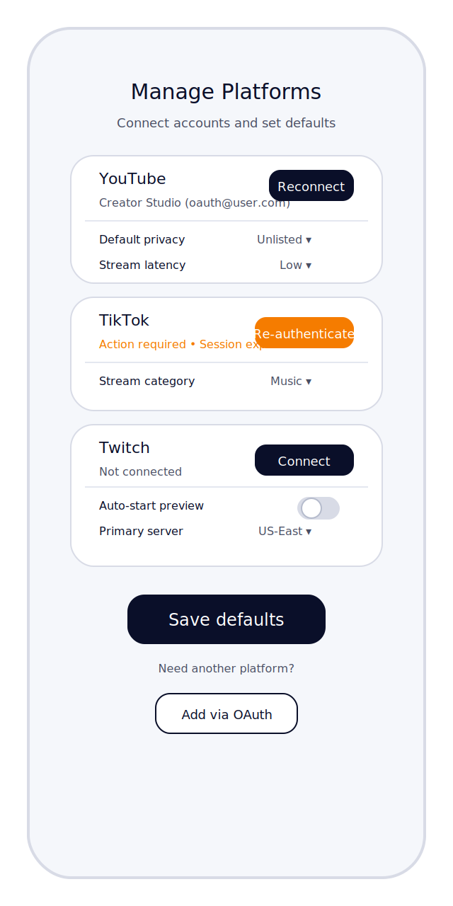
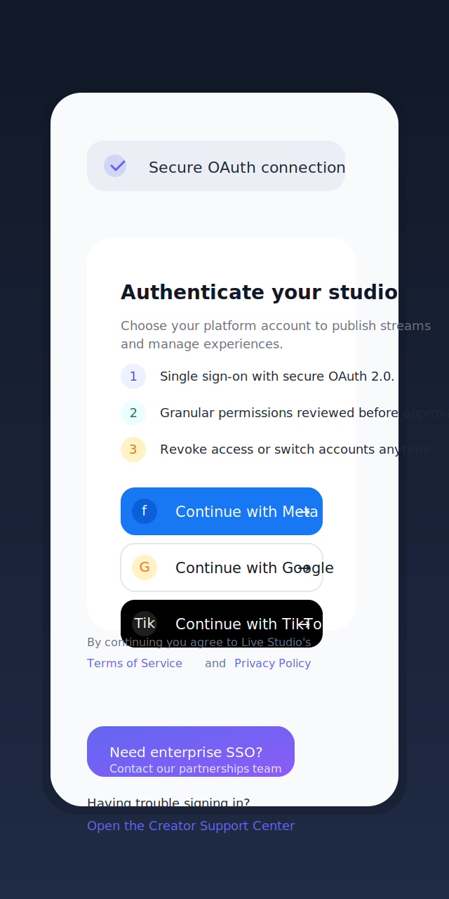
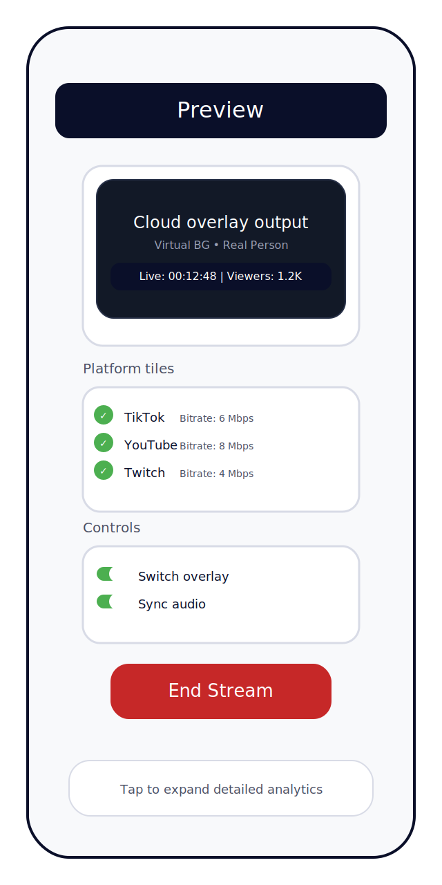

# Live Streaming App UI/UX Flow

## Overview
This document outlines the UI/UX flow for an iOS live streaming application that allows creators to configure cloud-based overlays and broadcast to multiple platforms. The design emphasizes a streamlined setup experience, rapid access to key actions, and transparency into the final composited stream.

## High-Level Navigation
- **Launch Overlay Screen** – default landing experience using the user’s saved overlay and platform preferences.
- **Settings** – edit overlay combinations, select virtual backgrounds or avatars, and manage streaming platform accounts.
- **Go Live Flow** – confirm overlay context, select platforms, and start the multi-platform broadcast.
- **Preview Tab** – live monitoring of the composited stream exactly as it appears to viewers on each platform.

## Sketch Mockups
The following lightweight wireframes provide a visual reference for the core moments of the flow. Each sketch illustrates the spatial hierarchy and primary actions without prescribing final visual polish.

- **Launch Overlay Screen** – highlights the default overlay preset, quick destination review, and the prominent `Go Live` CTA.

  

- **Overlay Settings** – showcases the three overlay combinations with expandable configuration cards and persistent platform toggles.

  

- **Virtual Background Library** – full-screen gallery for browsing curated backdrops, adding media from the device, and confirming the selection.

  

- **Platform Selection Modal** – demonstrates the confirmation sheet that appears after tapping `Go Live`, allowing multi-select of streaming destinations.

  

- **Platform Account Settings** – illustrates the dedicated screen for connecting platform accounts, configuring defaults, and triggering OAuth-based reauthentication.

  

- **OAuth Login Screen** – demonstrates the branded OAuth 2.0 entry point used when connecting Meta, Google, or TikTok accounts.

  

- **Preview Tab** – visualizes the live monitoring space with composited output, platform health tiles, and stream controls.

  

## Launch Overlay Screen
The first screen greets the user with their default overlay combination applied to the camera feed. Key elements:

| Region | Description |
| --- | --- |
| **Header** | App logo, profile avatar button (opens account & logout options). |
| **Overlay Preview Canvas** | Full-width, edge-to-edge preview showing the user’s camera composited with the chosen overlay option (virtual background, real scene, or avatar). Includes a subtle "Cloud Overlay Enabled" badge to communicate processing location. |
| **Overlay Controls Bar** | Pill buttons allowing quick toggles between the three overlay combinations. Each pill exposes a secondary sheet when long-pressed (virtual backgrounds gallery, avatar gallery, real scene picker). |
| **Bottom Action Row** | `Preview` tab button (left), prominent `Go Live` CTA (center), and `Settings` shortcut (right). |

Micro-interactions:
- Swiping horizontally on the Overlay Preview Canvas cycles overlay combinations; haptic feedback confirms each change.
- Tapping the overlay controls bar opens a mini selector sheet at the bottom with quick thumbnails for the selected combination.

## Overlay Settings
The Settings screen organizes options into sections that mirror the overlay combinations.

### Overlay Combination Selector
- Three segmented buttons (Virtual Background + Real Person, Real Scene + Real Person, Real Scene + Avatar) showing the currently selected default combination.
- When a combination is highlighted, the corresponding configuration panel expands below.

### Virtual Background Library
- Grid of static and animated backgrounds sourced from the cloud.
- Filters for **Photos**, **Videos**, **Favorites**, and **Recently Used**.
- Selecting a background updates the preview at the top of the screen and highlights the current default thumbnail in the Settings card.
- `+` button in the header opens the system picker to import media from the user’s device library; imported items are appended to the curated grid with a device badge.
- `Use Background` button confirms the choice and returns to Settings, where the chosen thumbnail is surfaced under **Virtual Background + Real Person**.

### Real Scene Configuration
- Access device camera feeds or saved real-scene clips.
- Toggle for **Auto Lighting Adjustment** to optimize the camera feed before cloud compositing.

### Avatar Gallery
- Horizontally scrolling carousel of avatars with badges for style (2D, 3D, stylized).
- Detail sheet for each avatar includes animation style preview, voice modulation toggle, and posture presets.

### Platform Settings
- List of connected platforms (TikTok, YouTube, Twitch) with status chips (Connected, Requires Login) and quick toggles to auto-select them for broadcasts.
- `Manage Platforms` button opens a full-screen account hub where creators connect, refresh, and remove destinations.
- Default multi-select toggle to pre-select platforms when tapping `Go Live`.

### Manage Platforms Flow
1. **Account Hub Screen**
   - Accessible from Settings or the `＋ Add platform` control in the Go Live picker without losing in-progress launch details.
   - Displays each supported platform with connection status, active account identity, and call-to-action buttons (`Connect`, `Reconnect`, or `Re-authenticate`).
   - Provides per-platform default settings surfaced as list rows—e.g., YouTube privacy level, Twitch ingest server, or TikTok category—mirroring the new mockup.
2. **Add Platform**
   - Tapping `Add via OAuth` opens a branded provider chooser (see OAuth login mockup) before launching an in-app browser or SFSafariViewController for the selected platform’s OAuth 2.0 authorization flow.
   - Quick-select buttons for **Meta**, **Google**, and **TikTok** surface status states (Connected, Needs attention) and accelerate re-connections without searching the account list.
   - The app requests scopes aligned with required streaming APIs (e.g., `youtube.readonly`, `tiktok.live.stream`, `channel:manage:broadcast`).
3. **OAuth 2.0 Integration**
   - After the user grants access, the OAuth redirect URI returns authorization codes to the app backend, which exchanges them for access and refresh tokens while recording the provider used.
   - Refresh tokens are stored securely (Keychain on-device plus encrypted sync with the cloud overlay service) to renew expiring sessions without user friction.
   - If a refresh fails, the platform card surfaces an "Action required" banner prompting reauthentication before the next stream.
4. **Account Removal**
   - Swipe actions or an overflow menu allow disconnecting a platform, revoking tokens server-side and clearing defaults.
5. **Save Defaults**
   - Changes only propagate to the launch screen and Go Live pre-selection once the user taps `Save defaults`, ensuring accidental edits are avoidable.

### Save & Reset Controls
- `Save as Default` primary button commits all changes.
- `Reset to Last Saved` secondary button discards interim tweaks.

## Go Live Flow
The CTA on the launch screen opens a modal sheet to finalize the broadcast.

1. **Overlay Confirmation Panel**
   - Displays the current overlay combination thumbnail, name, and key settings (e.g., background title or avatar name).
   - `Change` link returns to the Settings screen if adjustments are needed.
2. **Platform Picker**
   - Checklist of available platforms with live status indicators.
   - A trailing `Details ›` link on each row opens a slide-up destination sheet with context-specific actions (edit stream metadata, toggle chat relays, view ingest health) while still in the Go Live flow.
   - When a platform needs attention (e.g., Twitch reconnection), the sheet escalates to a full-screen OAuth reconnect sequence and returns the user to the picker on success.
   - `＋ Add platform` button opens the Manage Platforms hub so a new destination can be connected without abandoning the launch context.
   - Selecting multiple platforms shows expected total bitrate and estimated latency.
3. **Streaming Summary**
   - Shows stream title (editable), privacy options, and estimated start time.
   - `Go Live` button initiates the cloud overlay pipeline and triggers platform connections.
4. **Starting State**
   - Post-confirmation, display a progress indicator with steps: `Connecting to Cloud`, `Applying Overlay`, `Pushing to Platforms`.
   - Success transitions the user into the Preview tab.

## Preview Tab
The Preview tab is accessible both before and during a stream for real-time monitoring.

- **Top Bar**: Stream duration, viewer count (aggregated), and `End Stream` button.
- **Main Preview Area**: Shows the composited output exactly as the target platforms receive it, including any platform-specific cropping or overlays.
- **Platform Selector Chips**: Switch between platform previews; use picture-in-picture thumbnails for simultaneous monitoring.
- **Quality Indicators**: Color-coded badges for bitrate, dropped frames, or platform warnings.
- **Event Timeline Drawer**: Slide-up panel listing chat highlights, alerts from each platform, and automated system notifications.

## Empty & Error States
- If no platforms are connected, the launch screen displays an inline warning with a shortcut to `Manage Platforms`.
- On failed overlay application, show an overlay banner with retry and support options while falling back to a raw camera preview.

## Accessibility & Feedback Considerations
- Support Dynamic Type across all text components.
- VoiceOver labels for overlay selections, platform toggles, and status indicators.
- Haptic feedback for key actions: overlay combination switch, platform selection, `Go Live` confirmation, and stream termination.
- Provide a compact progress toast when defaults are saved or restored.

## Future Enhancements
- Integrate tutorial tooltips for first-time users explaining the cloud overlay process.
- Add collaborative presets that teams can share across accounts.
- Surface analytics summaries post-stream with a link from the Preview tab after ending a session.
